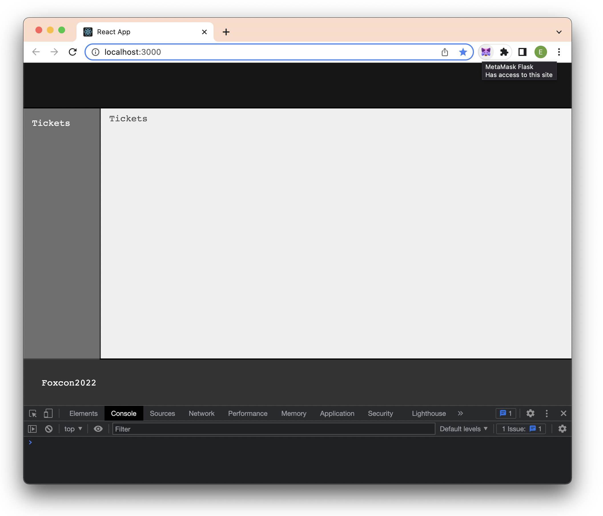
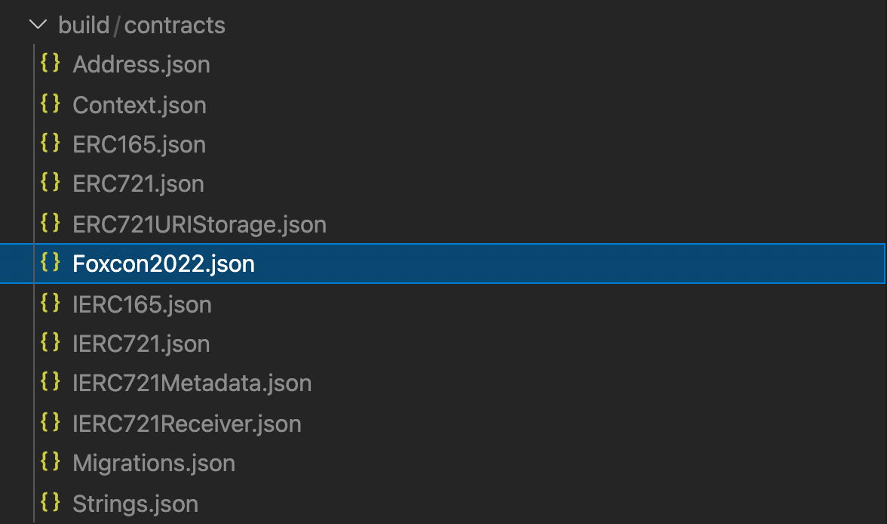

# Getting Started with This App

## Tool Prerequisites

You must have these tools installed/setup
- NVM or NodeJS
- [MetaMask Browser Extension](https://metamask.io)
  - Install and create a wallet address spcificaly for the workshop (use for testing)
  - You could setup another MetaMask throw away account on different browser or Setup Flask and disable your current MetaMask
- [Truffle](https://trufflesuite.com/docs/truffle)
    > npm i truffle -g
- [Infura](https://infura.io)
 - Setup a free account and create a Ethereum Project
 - Copy the following info into your `.env` file
  - ProjectId, Project Secret, Rinkeby, and Polygon Websocket Endpoint
- [solidity](https://marketplace.visualstudio.com/items?itemName=JuanBlanco.solidity)
  - This VS Code plugin will provide syntax highlighting and more
- [vscode-styled-components](https://marketplace.visualstudio.com/items?itemName=styled-components.vscode-styled-components)
  - This VS Code plugin will provide syntax highlighting for Styled Components in React Components
- [Get Test ETH](https://faucets.chain.link/rinkeby)
 - Select "Ethereum Rinkeby" Test Network and claim test ETH

## Optional Prerequisites

Add these VS Code extensions for productivity, code highlighting, and debugging: 

- [solidity-extended](https://marketplace.visualstudio.com/items?itemName=beaugunderson.solidity-extended)
- [solidity-debugger](https://marketplace.visualstudio.com/items?itemName=hosho.solidity-debugger)

## TOC

- [Step One](#step-one)
- [Step Two](#step-two)
- [Step Three](#step-three)

## Step One

**Complete this step immediately**

Ensure prerequisites above are installed.

We set up a working React project with some styles and pre-existing components to create a solid starting point for the workshop; the rest we will build with explanation along the way.

```bash
git clone https://github.com/metamask/nft-tickets-workshop && cd nft-tickets-workshop && git checkout start && npm i
```

Checkout `start` branch, install dependencies, and test that the client app works from its starting point:

```bash
git checkout start && npm i
```

This will install the following packages we have already included:
`ethers polished styled-components use-immer ncp dotenv @openzeppelin/contracts base64-sol ncp truffle-contract-size @truffle/hdwallet-provider`

Run `npm start` and ensure that you get a standard React Projects with no errors in the terminal or in the browser console. You should see a fairly blank application and no errors in the console.



## Step Two

1. We will start by initializing Truffle in our repository, open a second terminal in VS Code to run Truffle commands:

```bash
truffle init
```

This will add a config, a migrations contract, a migrations javascript file and a directory for tests:

```
├── truffle-config.js  
├── contracts  
│   └── Migrations.sol  
├── migrations  
│   └── 1_initial_migration.js  
├── test  
│   └── .gitkeep  
```

The Migrations contract contains a simple interface and helps to keep track of addresses on the blockchain and will aid us when we need to migrate our contract later.

2. Copy the following code into your `trufle-config.js` file:

```js
require('dotenv').config();

const HDWalletProvider = require('@truffle/hdwallet-provider')
const mnemonic = process.env.OWNER_MNEMONIC
const owner = process.env.OWNER_ADDRESS
const infura_endpoint_rinkeby = process.env.INFURA_ENDPOINT_RINKEBY
const infura_endpoint_polygon = process.env.INFURA_ENDPOINT_POLYGON

module.exports = {
  plugins: ["truffle-contract-size"],
  networks: {
    development: {
      host: "127.0.0.1",     // Localhost (default: none)
      port: 7545,            // Standard Ethereum port (default: none)
      network_id: "*",       // Any network (default: none)
    },
    polygon: {
      provider: () => new HDWalletProvider(
        mnemonic, infura_endpoint_polygon
      ),
      from: owner, // Public wallet address
      network_id: 80001,   // rinkeby's id
      gas: 5500000,        // rinkeby has a lower block limit than mainnet
      timeoutBlocks: 200,  // # of blocks before a deployment times out  (minimum/default: 50)
      skipDryRun: true     // Skip dry run before migrations? (default: false for public nets )
    },
    rinkeby: {
      provider: () => new HDWalletProvider(
        mnemonic, infura_endpoint_rinkeby
      ),
      from: owner, // Public wallet address
      network_id: 4,       // rinkeby's id
      gas: 5500000,        // rinkeby has a lower block limit than mainnet
      timeoutBlocks: 200,  // # of blocks before a deployment times out  (minimum/default: 50)
      skipDryRun: true     // Skip dry run before migrations? (default: false for public nets )
    }
  },

  // Set default mocha options here, use special reporters etc.
  mocha: {
    // timeout: 100000
  },

  // Configure your compilers
  compilers: {
    solc: {
      version: "0.8.4",    // Fetch exact version from solc-bin (default: truffle's version)
      // docker: true,     // Use "0.5.1" you've installed locally with docker (default: false)
      settings: {          // See the solidity docs for advice about optimization and evmVersion
       optimizer: {
         enabled: true,
         runs: 1000
       },
      //  evmVersion: "byzantium"
      }
    }
  },
}
```

3. Use Truffle to create a Contract:

```bash
truffle create contract Foxcon2022
```

The [ERC721Enumerable](https://docs.openzeppelin.com/contracts/4.x/api/token/erc721#IERC721Enumerable) interface is an optional interface we will use to give us additional features in our ERC721 token contract.

OpenZeppelin provides us with a set of libraries written in Solidity that you can import to your smart contracts. So you will see references to them in our imports.

To save time, we are going to copy in the entire finished contract right now, and we will go over each function live in the workshop and explain what each function and variable is doing for us:

This will create a file named: `Foxcon2022.sol` inside of our `contracts` directory with some boilerplate code. We will replace that code with the following:

```ts
// SPDX-License-Identifier: MIT
pragma solidity ^0.8.4;

import "@openzeppelin/contracts/token/ERC721/extensions/ERC721Enumerable.sol";
import "@openzeppelin/contracts/utils/Counters.sol";
import "@openzeppelin/contracts/access/Ownable.sol";
import "@openzeppelin/contracts/utils/Strings.sol";
import 'base64-sol/base64.sol';

import './HexStrings.sol';

/* 
  visibility modifiers
  ------------------------------------------------------
  public: anyone can call
  private: only this contract
  internal: only this contract and inheriting contracts
  external: only external calls (not this contract)
*/

contract Foxcon2022 is ERC721Enumerable, Ownable {
  using Strings for uint256;
  using HexStrings for uint160;
  using Counters for Counters.Counter;
  Counters.Counter private _tokenIds;

  uint16 _myTotalSupply = 0; // max value 65,535
  address _owner;

  // * size added 0.3KB
  uint16 public MAX_SUPPLY = 8999; // max value 65,535
  uint256 public constant vipTicketPrice = 20000000000000000; //0.02 ETH
  uint256 public constant gaTicketPrice = 10000000000000000; //0.01 ETH

  // mapping (uint256 => bool) public gaTicketHolders;
  mapping (uint256 => bool) public vipTicketHolders;

  constructor() ERC721("Foxcon2022", "FXC22") {
    _tokenIds._value = 999;
    _owner = msg.sender;
  }

  mapping (uint256 => bytes3) public color;
  uint256 mintDeadline = block.timestamp + 168 hours;

  function totalSupply() view public override returns(uint256) {
    return _myTotalSupply; // gas optimization (otherwise totalSupply() when mint)
  }

  /**
    * @dev Returns the tokens owned by a given wallet. For use mainly on frontend.
    * @param _wallet The wallet to get the tokens of. NEEDS ENUMERABLE
    // * size added 0.3KB
  */
  function walletOfOwner(address _wallet) public view returns (uint256[] memory) {
    uint256 tokenCount = balanceOf(_wallet);

    uint256[] memory tokensId = new uint256[](tokenCount);
    for (uint256 i; i < tokenCount; i++) {
      tokensId[i] = tokenOfOwnerByIndex(_wallet, i);
    }
    return tokensId;
  }

  function contractURI() public pure returns (string memory) {
    string memory image = Base64.encode(bytes(generateCollectionSvg()));

    bytes memory collectionJsonString = bytes(abi.encodePacked(
      '{"name":"Foxcon2022",',
      '"description":"Foxcon2022 is the most premier fox event in the solar system this year. Join friends from all over the world this December as the skulk descend on the Web3 space and dig their paws into everything Ethereum. Stay foxy, your NFT purchase is your ticket to the event!",', 
      '"image":"data:image/svg+xml;base64,',image,'",'
      '"external_link": "https://metamask.io"}'
    ));

    return string(
      abi.encodePacked(
        'data:application/json;base64,',
        Base64.encode(bytes(abi.encodePacked(collectionJsonString)))
      )
    );
  }

  function generateCollectionSvg() internal pure returns (string memory) {
    return string(abi.encodePacked(
      '<svg preserveAspectRatio="xMinYMin meet" viewBox="0 0 35 33" xmlns="http://www.w3.org/2000/svg" style="stroke-linejoin:round;stroke-miterlimit:2;">',
        '<g><path d="M10.286,29.139L10.285,29.138L2.499,31.283L0.289,23.679L0.288,23.679L2.677,16.226L2.69,16.222L2.677,16.226L1.098,14.369L1.785,13.874L0.686,12.871L1.524,12.21L0.425,11.372L1.153,10.822L-0,5.211L1.73,0L1.73,0L12.866,4.166L12.866,4.167L22.134,4.167L22.134,4.166L33.27,0L35,5.211L33.847,10.822L34.575,11.372L33.476,12.21L34.314,12.871L33.215,13.874L33.902,14.369L32.323,16.226L32.302,16.22L32.322,16.226L34.725,23.679L32.501,31.283L24.715,29.138L24.715,29.137L24.714,29.137L23.205,30.374L20.129,32.506L14.87,32.506L11.795,30.374L10.286,29.139ZM14.912,29.604L14.582,29.907L14.912,29.604L14.582,29.907L14.912,29.604ZM20.088,29.604L20.774,29.864L20.088,29.604ZM20.088,29.604L20.06,26.869L19.401,26.415L19.402,26.413L19.416,20.255L20.308,21.725L19.416,20.255L19.594,17.752L27.31,17.408L27.31,17.408L19.594,17.751L19.595,17.736L19.415,20.255L19.401,26.415L15.598,26.415L15.598,26.414L15.443,21.757L15.406,17.753L15.443,21.757L13.552,19.333L10.82,20.585L15.443,21.757L15.598,26.415L14.939,26.869L14.911,29.604L20.088,29.604ZM24.716,29.137L28.354,23.679L24.716,29.137ZM20.061,26.868C20.061,26.868 20.947,26.175 21.834,25.482C22.72,24.789 24.07,23.733 24.07,23.733L20.061,26.868ZM7.689,17.408L10.82,20.585L7.69,17.409L7.689,17.408ZM10.82,20.585C10.82,20.585 12.16,20.973 10.82,20.585C9.838,20.301 10.83,20.588 10.82,20.585C10.799,20.579 10.82,20.585 10.82,20.585ZM27.31,17.408L24.194,20.585L21.447,19.333L20.308,21.726L24.193,20.585L24.07,23.733L24.194,20.585L27.31,17.408ZM7.689,17.408L15.406,17.752L15.406,17.751L7.689,17.408L7.689,17.408Z" style="fill:none;fill-rule:nonzero;stroke:black;stroke-width:0.5px;"/></g>',
      '</svg>'
    ));
  }

  modifier canMint() {
    require(_myTotalSupply < MAX_SUPPLY, 'All tickets have been minted.');
    require(block.timestamp < mintDeadline, 'Minting period has expired.');
    require(vipTicketPrice == msg.value || gaTicketPrice == msg.value, "Ether value sent is not correct.");
    _; // Underscores used in function modifiers return and continue execution of the decorated function
  }

  function mintItem() public payable canMint returns (uint256) {
    // canMint happens first or throws

    _tokenIds.increment();
    uint256 id = _tokenIds.current();
    _safeMint(msg.sender, id);

    if (msg.value == vipTicketPrice) {
      vipTicketHolders[id] = true;
    }

    _myTotalSupply++;
    payable(_owner).transfer(msg.value);

    return (id);
  }

  function tokenURI(uint256 id) public view override returns (string memory) {
    require(_exists(id), "not exist");
    string memory name = string(abi.encodePacked('Ticket #', id.toString() ));
    string memory description = string(abi.encodePacked((vipTicketHolders[id] ? "VIP" : "General Admission"), ' access to Foxcon2022 on Dec, 10, 2022.'));

    bytes memory tokenJsonString = bytes(abi.encodePacked(
      '{"name":"', name, '","description":"',description,'",', 
      //'"external_url":"https://dappblitz.eth/', id.toString(),'",',
      '"attributes":[{"trait_type":"Ticket Type", "value":"', (vipTicketHolders[id] ? "VIP" : "GA"),  '"}],',
      '"owner":"', (uint160(ownerOf(id))).toHexString(20),'",',
      '"image":"',generateNftSvgByTokenId(id),'"}'
    ));

    return string(
      abi.encodePacked(
        'data:application/json;base64,',
        Base64.encode(bytes(tokenJsonString))
      )
    );
  }

  /* 
    // * size added 9.92KB
  */
  function generateNftSvgByTokenId(uint256 id) public view returns (string memory) {
    return string(abi.encodePacked(
      'data:image/svg+xml;base64,',
      Base64.encode(bytes(abi.encodePacked(
        '<svg preserveAspectRatio="xMinYMin meet" viewBox="0 0 300 300" xmlns="http://www.w3.org/2000/svg" style="fill-rule:evenodd;clip-rule:evenodd;user-select: none;">',
          renderNftSvgBottomById(id),
          renderNftSvgTopById(id),
          '<style>.s1{font-family:"BalooDa2-ExtraBold";} .s4{font-family:"BalooDa2-Regular";} .s3{font-size:108px;} .s5{fill:#FFF;} .s2{fill:#FF9200;} .s6{fill:#3C3C3C;} .s7{fill:#532775;}</style>',
        '</svg>'
      ))
    )));
  }
  function renderNftSvgTopById(uint256 id) internal view returns (string memory) {
    return string(abi.encodePacked(
      '<g id="top" transform="matrix(0.99784,0,0,1,2.87767e-18,0)"><path class="',(vipTicketHolders[id] ? "s6" : "s7"), '" d="M30,200L20,200C20,188.962 11.038,180 0,180L0,15.368C0,6.886 6.886,0 15.368,0L285.281,0C293.763,0 300.649,6.886 300.649,15.368L300.649,180.033L300,180C288.962,180 280,188.962 280,200L270,200L270,199L264.99,199L264.99,200L260.981,200L260.981,199L255.971,199L255.971,200L251.962,200L251.962,199L246.952,199L246.952,200L242.944,200L242.944,199L237.933,199L237.933,200L233.925,200L233.925,199L228.914,199L228.914,200L224.906,200L224.906,199L219.896,199L219.896,200L215.887,200L215.887,199L210.877,199L210.877,200L206.367,200L206.367,199L201.357,199L201.357,200L197.349,200L197.349,199L192.338,199L192.338,200L188.33,200L188.33,199L183.319,199L183.319,200L179.311,200L179.311,199L174.301,199L174.301,200L170.292,200L170.292,199L165.282,199L165.282,200L161.273,200L161.273,199L156.263,199L156.263,200L152.255,200L152.255,199L147.244,199L147.244,200L143.236,200L143.236,199L138.225,199L138.225,200L134.217,200L134.217,199L129.207,199L129.207,200L125.198,200L125.198,199L120.188,199L120.188,200L116.18,200L116.18,199L111.169,199L111.169,200L107.161,200L107.161,199L102.15,199L102.15,200L98.142,200L98.142,199L93.132,199L93.132,200L89.123,200L89.123,199L84.113,199L84.113,200L80.104,200L80.104,199L75.094,199L75.094,200L71.086,200L71.086,199L66.075,199L66.075,200L62.067,200L62.067,199L57.056,199L57.056,200L53.048,200L53.048,199L48.038,199L48.038,200L44.029,200L44.029,199L39.019,199L39.019,200L35.01,200L35.01,199L30,199L30,200Z" /></g>',
      '<g id="ticketNumber" transform="matrix(0.759459,0,0,0.759459,-97.1428,-1.84609)"><text x="392px" y="208px" text-align="end" class="s1 s2" style="font-size:36px;">#',id.toString(),'</text></g>',
      '<g id="dateText" transform="matrix(0.955615,0,0,0.891404,-0.890378,-58.3668)"><text x="24px" y="240px" class="s4 s5" style="font-size:30px;">10 DEC / ',(vipTicketHolders[id] ? "VIP" : "GA"),'</text></g>',
      '<g id="event" transform="matrix(1.06305,0,0,1.06305,-130.636,-63.8082)"><path id="01F" d="M142.518,87.342L173.881,87.342L173.881,98.119L154.373,98.119L154.373,119.136L169.678,119.136L169.678,129.914L154.373,129.914L154.373,162.786L142.518,162.786L142.518,87.342Z" class="s2" style="fill-rule:nonzero;"/><path id="02O" d="M196.73,163.864C190.91,163.864 186.455,162.212 183.366,158.906C180.276,155.601 178.731,150.931 178.731,144.895L178.731,105.233C178.731,99.197 180.276,94.527 183.366,91.222C186.455,87.916 190.91,86.264 196.73,86.264C202.55,86.264 207.005,87.916 210.095,91.222C213.184,94.527 214.729,99.197 214.729,105.233L214.729,144.895C214.729,150.931 213.184,155.601 210.095,158.906C207.005,162.212 202.55,163.864 196.73,163.864ZM196.73,153.086C200.826,153.086 202.873,150.607 202.873,145.65L202.873,104.478C202.873,99.521 200.826,97.042 196.73,97.042C192.634,97.042 190.587,99.521 190.587,104.478L190.587,145.65C190.587,150.607 192.634,153.086 196.73,153.086Z" class="s2" style="fill-rule:nonzero;"/><path id="03X" d="M231.435,124.202L218.393,87.342L230.896,87.342L238.871,111.7L239.087,111.7L247.278,87.342L258.487,87.342L245.446,124.202L259.134,162.786L246.631,162.786L238.009,136.489L237.794,136.489L228.956,162.786L217.747,162.786L231.435,124.202Z" class="s2" style="fill-rule:nonzero;"/><path id="04C" d="M279.719,163.864C274.043,163.864 269.714,162.248 266.732,159.014C263.75,155.781 262.259,151.218 262.259,145.326L262.259,104.802C262.259,98.91 263.75,94.347 266.732,91.114C269.714,87.88 274.043,86.264 279.719,86.264C285.396,86.264 289.725,87.88 292.707,91.114C295.689,94.347 297.179,98.91 297.179,104.802L297.179,112.777L285.971,112.777L285.971,104.047C285.971,99.377 283.995,97.042 280.043,97.042C276.091,97.042 274.115,99.377 274.115,104.047L274.115,146.189C274.115,150.787 276.091,153.086 280.043,153.086C283.995,153.086 285.971,150.787 285.971,146.189L285.971,134.656L297.179,134.656L297.179,145.326C297.179,151.218 295.689,155.781 292.707,159.014C289.725,162.248 285.396,163.864 279.719,163.864Z" class="s2" style="fill-rule:nonzero;"/><path id="05O" d="M321.645,163.864C315.825,163.864 311.37,162.212 308.281,158.906C305.191,155.601 303.646,150.931 303.646,144.895L303.646,105.233C303.646,99.197 305.191,94.527 308.281,91.222C311.37,87.916 315.825,86.264 321.645,86.264C327.465,86.264 331.92,87.916 335.01,91.222C338.099,94.527 339.644,99.197 339.644,105.233L339.644,144.895C339.644,150.931 338.099,155.601 335.01,158.906C331.92,162.212 327.465,163.864 321.645,163.864ZM321.645,153.086C325.741,153.086 327.789,150.607 327.789,145.65L327.789,104.478C327.789,99.521 325.741,97.042 321.645,97.042C317.55,97.042 315.502,99.521 315.502,104.478L315.502,145.65C315.502,150.607 317.55,153.086 321.645,153.086Z" class="s2" style="fill-rule:nonzero;"/><path id="06N" d="M347.62,87.342L362.493,87.342L374.025,132.501L374.241,132.501L374.241,87.342L384.803,87.342L384.803,162.786L372.624,162.786L358.398,107.712L358.182,107.712L358.182,162.786L347.62,162.786L347.62,87.342Z" class="s2" style="fill-rule:nonzero;"/></g>'
    ));
  }
  function renderNftSvgBottomById(uint256 id) internal view returns (string memory) {
    string memory ticketType = vipTicketHolders[id] ? "VIP" : "General Admission";
    return string(abi.encodePacked(
      '<g id="stub1" transform="matrix(1.13574,0,0,1,-32.7365,0.204182)"><path class="',(vipTicketHolders[id] ? "s6" : "s7"), '" d="M266.04,199.796L274.826,199.796C274.826,210.834 282.7,219.796 292.398,219.796L292.968,219.763L292.968,284.428C292.968,292.91 286.918,299.796 279.466,299.796L42.326,299.796C34.874,299.796 28.824,292.91 28.824,284.428L28.824,219.796C38.522,219.796 46.395,210.834 46.395,199.796L55.181,199.796L55.181,200.796L59.583,200.796L59.583,199.796L63.105,199.796L63.105,200.796L67.507,200.796L67.507,199.796L71.029,199.796L71.029,200.796L75.431,200.796L75.431,199.796L78.952,199.796L78.952,200.796L83.354,200.796L83.354,199.796L86.876,199.796L86.876,200.796L91.278,200.796L91.278,199.796L94.8,199.796L94.8,200.796L99.202,200.796L99.202,199.796L102.724,199.796L102.724,200.796L107.126,200.796L107.126,199.796L110.647,199.796L110.647,200.796L115.049,200.796L115.049,199.796L118.571,199.796L118.571,200.796L122.973,200.796L122.973,199.796L126.495,199.796L126.495,200.796L130.897,200.796L130.897,199.796L134.418,199.796L134.418,200.796L138.821,200.796L138.821,199.796L142.342,199.796L142.342,200.796L146.744,200.796L146.744,199.796L150.266,199.796L150.266,200.796L154.668,200.796L154.668,199.796L158.19,199.796L158.19,200.796L162.592,200.796L162.592,199.796L166.113,199.796L166.113,200.796L170.515,200.796L170.515,199.796L174.037,199.796L174.037,200.796L178.439,200.796L178.439,199.796L181.961,199.796L181.961,200.796L186.363,200.796L186.363,199.796L189.885,199.796L189.885,200.796L194.287,200.796L194.287,199.796L197.808,199.796L197.808,200.796L202.21,200.796L202.21,199.796L205.732,199.796L205.732,200.796L210.134,200.796L210.134,199.796L214.096,199.796L214.096,200.796L218.498,200.796L218.498,199.796L222.02,199.796L222.02,200.796L226.422,200.796L226.422,199.796L229.943,199.796L229.943,200.796L234.345,200.796L234.345,199.796L237.867,199.796L237.867,200.796L242.269,200.796L242.269,199.796L245.791,199.796L245.791,200.796L250.193,200.796L250.193,199.796L253.714,199.796L253.714,200.796L258.117,200.796L258.117,199.796L261.638,199.796L261.638,200.796L266.04,200.796L266.04,199.796Z" /></g>',
      '<g id="stub2" transform="matrix(0.489601,0,0,0.489601,36.3616,34.5613)"><text x="78px" y="455px" class="s1 s3 s5">#',id.toString(),'</text></g>',
      '<g id="stub3" transform="matrix(0.160667,0,0,0.160667,66.1511,212.911)"><text x="62px" y="410px" class="s1 s3 s2">',ticketType,'</text></g>'
    ));
  }

}
```

4. We need to create a migrations file for this contract, so let's create a file inside of the `migrations` directory named: `2_setup_Foxcon2022.js` and add the following code:

```js
const Foxcon2022 = artifacts.require("Foxcon2022");

module.exports = function (deployer) {
  deployer.deploy(Foxcon2022);
};
```

5. Create a file named `HexStrings.sol` and copy in the following [library](https://jeancvllr.medium.com/solidity-tutorial-all-about-libraries-762e5a3692f9) code:


```ts
// SPDX-License-Identifier: MIT
pragma solidity ^0.8.4;

library HexStrings {
  bytes16 internal constant ALPHABET = '0123456789abcdef';

  function toHexString(uint256 value, uint256 length) internal pure returns (string memory) {
    bytes memory buffer = new bytes(2 * length + 2);
    buffer[0] = '0';
    buffer[1] = 'x';
    for (uint256 i = 2 * length + 1; i > 1; --i) {
        buffer[i] = ALPHABET[value & 0xf];
        value >>= 4;
    }
    return string(buffer);
  }
}
```

In the workshop, we will discuss contract size using on-chain SVG assets, and we will discuss the code that is commented out and why. This workshop primarily focuses on MetaMask functionality in React, but interacting with a Smart Contract is needed. This contract is supplied so that we have something to work with and is not considered the holy grail but will allow us to get straight to work on our client.

6. Create a `.env` file and ensure that you have already set up your MetaMask wallet and Infura account. Add the correct values for each item in our environment variables file. You will not yet have a `REACT_APP_CONTRACT_ADDRESS`, so leave it blank for now.

```
INFURA_PROJECT_ID=
INFURA_PROJECT_SECRET=

INFURA_ENDPOINT_RINKEBY=wss://rinkeby.infura.io/ws/v3/<INFURA_PROJECT_ID>
INFURA_ENDPOINT_POLYGON=wss://polygon-mumbai.infura.io/ws/v3/<INFURA_PROJECT_ID>
OWNER_MNEMONIC="one two three four five six seven eight nine ten eleven twelve"
OWNER_ADDRESS=<MetaMask Wallet Address>

REACT_APP_CONTRACT_ADDRESS=
```

> For this demo, we will not be adhering to the standard contract size needed for mainnet, we will only deploy to testnets and more work would need to be done in order to optimize your contract size for production deployments on miannet. But what we have will enable us to develop our frontend!

7. Deploy our contract to Rinkeby

```bash
truffle migrate --network rinkeby
```

Once this process finishes, you will see that your contract has been deployed. You need to copy the Contract Address and paste it into your `.env` file.

```text
2_setup_Foxcon2022.js
=====================

   Deploying 'Foxcon2022'
   ----------------------
   > transaction hash:    0x5c0520b220b2c91b328f406754a0006159fd4e6890459f74b0dae0a2e87e792c
   > Blocks: 1            Seconds: 12
   > contract address:    0x681B7D96B5E4d70272B7f87dFDD8cF14758C0B28
```

Since we are importing a few OpenZeppelin files that have their own dependencies, we will get much more than our one RPC contract, `Foxcon2022.json`, built out into our `build/contracts` directory. As you can also see, these directories are ignored by git. 



With this in place, we can start building our frontend!

As a final note, if we want to automate the process of removing the `build` directory and recompiling and deploying our contracts, we can add the following lines to our `package.json` scripts object:

Copy the following code into the `package.json` just below the `eject` script:

```json
    "clean:contract": "rm -rf build",
    "clean:artifacts": "rm -fr src/lib/*",
    "clean:node": "rm -rf node_modules",
    "clean": "npm run clean:contract && npm run clean:artifacts && npm run clean:node",
    "build:contract": "truffle compile",
    "build:migrate": "truffle migrate --network rinkeby | tee compile.log",
    "build:env": "sed -i '' -E \"s/REACT_APP_CONTRACT_ADDRESS=.+/REACT_APP_CONTRACT_ADDRESS=$(cat compile.log | grep 'contract address' | tr ' ' '\n' | tail -1)/\" .env",
    "build:artifacts": "node scripts/artifacts.js ",
    "build:all": "npm run build:contract && npm run build:migrate && npm run build:env && npm run build:artifacts",
    "setup": "npm run clean && npm ci && npm run build:all"
```

Now you can run `npm run setup` to clean your build folder and copy the ABI to the React project.

Once this is done, you will need to run: `npm start` to start the client

This concludes the Solidity portion of the workshop. We now have a backend (so to speak) for our Minting app to talk to and interact with.

## Step Three

We will now focus on the Client Minting for our ERC-721 Tickets/Tokens.

### Update Context Provider `ViewProvider.js`

- Build the ViewProvider using [Context API](https://reactjs.org/docs/context.html)

For global state management, where data needs to be accessible by many components/levels in our application, we have the Context API. The Context API ships with React, so there are no dependencies to install.

1. We have a file at `src/context/ViewProvider.js` that has some boilerplate setup, but we need to add some more imports outside of `initialState`, and `reducer`, Which allow our state to be modified by various functions.

Add the following code in place of `/* Additional Imports */`:

```js
import { useImmerReducer } from 'use-immer'
import { ethers } from 'ethers'

import foxcon2022Abi from '../lib/Foxcon2022.json'
```

- Why `useImmerReducer`?

Updating a state can be a nightmare when you store an object with many nested properties (`initialState`), where only one of which you want to change.

Read more on `useImmerReducer` [at this blog](https://vhudyma-blog.eu/react-hooks-useimmer-and-useimmerreducer) on your own time and trust it's a good idea here for simplicity

- Why Ethers

Ethers can be used in your client, scripts, and NodeJS code to talk to an Ethereum node (Infura endpoint in our case). Its tools and utilities make our life easier working with Smart Contracts on Ethereum. A suggested resource for learning more is the [Master Ethers.js for Blockchain Step-By-Step](https://youtube.com) by [Gregory at Dapp University](https://www.youtube.com/c/DappUniversity).


- Why do we need the contract ABI?

It is very similar to an API (Application Program Interface), a human-readable representation of our contract's interface. The ABI defines the methods and structures used to interact with the binary representation of our Solidity smart contract.

2. Add two utility functions to enable converting Ether values from "0.01" to "10000000000000000" and vice versa.

Add the following code in place of `/* Num Format Utilities */`:

```js
// Get ETH as small number ("0.01" => "10000000000000000")
export const bigNumberify = (amt) => ethers.utils.parseEther(amt)

// Get ETH as small number ("10000000000000000" => "0.01")
export const smolNumberify = (amt, decimals = 18) => 
 parseFloat(ethers.utils.formatUnits(amt, decimals))
```

3. Add top-level code to our ViewProvider component

Add the following code in place of `/* Top Level Code */`:

```js
  const [state, dispatch] = useImmerReducer(reducer, initialState)
  const foxcon2022Address = process.env.REACT_APP_CONTRACT_ADDRESS
```

This sets up our immer reducer and creates a value for our contract address.

4. Add logic to `setAccounts` function

Add the following code in place of `/* setAccount callback */` 
Add `dispatch` in dependency array:

```js
    if (accounts.length > 0) {
      try {
        const connectedAccount = {
          address: accounts[0],
        }
        dispatch({ type: 'SET_ACCOUNT', payload: connectedAccount })
      } catch (e) {
        console.error(e)
      }
    } else {
      dispatch({ type: 'SET_ACCOUNT', payload: initialState.user })
    }
```

5. Add logic to `connectUser` function

Add the following code in place of `/* connectUser callback */` 
Add `setAccount, dispatch, foxcon2022Address` in dependency array:

```js
    try {
      const provider = new ethers.providers.Web3Provider(window.ethereum)
      if (provider) {
        const signer = await provider.getSigner()
        const { name, chainId } = await provider.getNetwork()
        const foxcon2022 = new ethers.Contract(foxcon2022Address, foxcon2022Abi.abi, signer)
        const accounts = await window.ethereum.request({ method: 'eth_accounts' })
        setAccount(accounts)
        dispatch({
          type: 'CONNECTED_PROVIDER',
          payload: {
            provider,
            signer,
            chainId,
            name,
            foxcon2022
          }
        })
      }
    } catch (e) {
      console.error(e)
    }
```

This is where the work is done to use Ethers, connect to the ethereum provider and our contract and store all of this data in one central place for use throughout our components. This is the meat and potatoes of our Context.

6. Add logic to `connectUser Effect`

Add the following code in place of `/* connectUser Effect */` 
Add `connectUser, dispatch` in dependency array:

```js
    if (window.ethereum) {
      connectUser()
      window.ethereum.on('accountsChanged', () => {
        connectUser()
      })
      window.ethereum.on('chainChanged', () => {
        connectUser()
      })
      window.ethereum.on('disconnect', () => {
        dispatch({ type: 'SET_ACCOUNT', payload: initialState.user })
      })
    }
```

This checks to ensure `window.ethereum` exists and listens to various events we want to subscribe to use the `.on` keyword (`accountsChanged`, `chainChanged`, and `disconnect`). These will fire when someone connects, changes chain or disconnects from the ethereum provider using MetaMask.

7. Gets the values (destructuring) needed for supplying data to our child components.

Add the following code in place of `/* Destructure State */` 

```js
  const { foxcon2022, isConnected, signer, name, chainId, provider, user } = state
```

8. Await the `eth_requestAccounts` and use its return value to `setAccount()`

Add the following code in place of `/* connect function */` 

```js
  const connect = async () => {
    try {
      const accounts = await window.ethereum.request({ method: 'eth_requestAccounts' })
      setAccount(accounts)
    } catch (e) {
      console.error(e)
    }
  }
```

9. Supply the required data and methods to child components using React props

Add the following code in place of `/* Provider State Values */` 

```js
        state,
        dispatch,
        foxcon2022,
        isConnected,
        provider,
        signer,
        user,
        name,
        chainId,
        actions: { connect },
        bigNumberify,
        smolNumberify
```

With the Context created we will now add the required code to each of the components that make up the Minting process of our application.

### Review Existing Components `src/components/*`

1. We will start by reviewing the components in the `atoms` directory, these are components that are used in our molecules component directory.

- `Button.js` and `Link.js`

These are components that represent the `<button></button>` and `<a></a>` tags in our molecule components used to install MetaMask and connect to MetaMask and connect to the correct chain/network.

In a larger more scaled application, these components might be used in more than just a few molecule components.

2. Next, we will review the components in the `molecules` directory, these are components that are used in throughout `templates` or `views`. In other words components that represent pages or subcomponents of pages that are represented by routes or template-like components. These components are typically not re-used in our applications.

3. Finally, we have our `templates`, these are components that although can be reused, are typically composed of `atoms` and `molecules` as well are typically referenced inside of `views` wwhich are components that represent certain areas of a website that contain routes and sub-routes like `Tickets`, `TicketDetails` or are components that span multiple routes like `TicketsOwned`.

You don't have to organize your components in this specific directory structure, but for this Dapp, it just made sense to have a single View, we call it `Home.js` just for lack of a better name. 

This component could have also been named `Frame` or something else, but it contains (the frame of our application) structured layout and a place where routes can load (Tickets and TicketDetails).

### Update Root Component `index.js`

1. Import Context into our Root Component

Add the following code in place of `/* Imports */` 

```js
import { ViewProvider } from './context/ViewProvider'
```

2. Wrap the `<Home />` component with the `ViewProvider` tag

```js
  <React.StrictMode>
    <ViewProvider>
      <Home />
    </ViewProvider>
  </React.StrictMode>,
```

This will supply all children components of the `Home` component with our Context data.

### Update TicketsOwned Component `templates/TicketsOwned.js`

1. Add Imports to TicketsOwned component

Add the following code in place of `/* Imports and Style Definitions */`

```js
import { useState, useEffect, useContext } from 'react'
import styled from 'styled-components'
import { ViewContext } from '../../context/ViewProvider'

const Wrap = styled.div`
  display: grid;
  grid-template-columns: repeat(4, 166px);
  grid-template-rows: repeat(150px);
  /* border: 1px solid blue; */
`
const SvgItem = styled.div`
  width: 150px;
  padding: 8px;
  cursor: pointer;
  &:hover img {
    opacity:0.5
  }
  /* border: 1px solid red; */
`
```

2. Add top-level code to our TicketsOwned component

Add the following code in place of `/* Top Level Code */`:

```js
  const { user, foxcon2022, provider } = useContext(ViewContext)
  const { address } = user
  const [ownedTickets, setOwnedTickets] = useState([])
  const [ticketCollection, setTicketCollection] = useState([])

  const getOwnedTickets = async () => {
    let mintedTickets = await foxcon2022.walletOfOwner(address)
    setOwnedTickets(mintedTickets)
  }

  useEffect(() => {
    if (provider) {
      provider.on('block', getOwnedTickets)
    }
    // eslint-disable-next-line react-hooks/exhaustive-deps
  }, [provider])

  useEffect(() => {
    if (provider) {
      let ticketsRetrieved = []
      if(ownedTickets.length > 0) {
        const promises = ownedTickets.map(async(t) => {
          const currentTokenId = t.toString()
          let currentTicket = await foxcon2022.tokenURI(currentTokenId)
          let base64ToString = window.atob(currentTicket.replace('data:application/json;base64,', ''))
          base64ToString = JSON.parse(base64ToString)
  
          ticketsRetrieved.push({
            tokenId: currentTokenId,
            svgImage: base64ToString.image,
            ticketType: base64ToString.attributes.find((x) => x.trait_type === "Ticket Type"),
          })
        })
        Promise.all(promises).then(() => setTicketCollection(ticketsRetrieved))
      }
    }
    // eslint-disable-next-line react-hooks/exhaustive-deps
  }, [ownedTickets])

  let listOfTickets = ticketCollection.map(ticket =>
    <SvgItem key={`ticket${ticket.tokenId}`}>
      <a href={`https://testnets.opensea.io/assets/${process.env.REACT_APP_CONTRACT_ADDRESS}/${ticket.tokenId}`}
        alt={`View Token ${ticket.tokenId} on OpenSea!`} target="_blank" rel="noopener noreferrer"
      >
        
      </a>
    </SvgItem>
  )

```

3. Add JSX to Tickets component

Add the following code in place of `{/* JSX */}` *as well as the line below it:

```js
      <hr height="1" />
      { ownedTickets.length > 0
        ? <>
            <div>You have {ownedTickets.length} ticket{ownedTickets.length > 1 ? 's' : ''}, click to view on OpenSea!</div>
            <Wrap>{listOfTickets}</Wrap>
          </>
        : null
      }
```

### Update Tickets Component `templates/Tickets.js`

1. Add Imports to Tickets component

Add the following code in place of `/* Imports and Style Definitions */`

```js
import styled from 'styled-components'
import { Link } from 'react-router-dom'

const Wrap = styled.div`
  display: grid;
  grid-template-columns: repeat(2, 280px);
  grid-template-rows: repeat(1, 120px);
  /* border: 1px solid red; */
`
const NftCard = styled.div`
  height: 80px;
  width: 260px;
  border-radius: 12px;
  border: 1px solid #cfcfcf;
  margin: 8px;
`
const NftCollName = styled.div`
  padding: 8px;
`
const NftName = styled.div`
  padding: 8px;
  font-weight: 600;
`
```

2. Add top-level code to our Tickets component

Add the following code in place of `/* Top Level Code */`:

```js
  let nftGrid = tickets.map((ticket, i) =>
    <NftCard key={`ticket${i}`}>
      <Link to={`/${ticket.type}`}>
        <NftCollName>{ticket.event}</NftCollName>
        <NftName>{ticket.description}</NftName>
      </Link>
    </NftCard>
  )

```

3. Add JSX to Tickets component

Add the following code in place of `{/* JSX */}` *as well as the line below it:

```js
      <h1>Tickets Available</h1>
      <Wrap>{nftGrid}</Wrap>
```

### Update Tickets Component `templates/TicketDetails.js`

1. Add Imports to TicketDetails component

Add the following code in place of `/* Imports and Style Definitions */`

```js
import { useContext, useState } from 'react'
import styled from 'styled-components'
import { ViewContext } from '../../context/ViewProvider'

const NftCard = styled.div`
  width: 300px;
  height: 390px;
  border-radius: 12px;
  border: 1px solid #cfcfcf;
  margin: 8px;
  /* border: 1px solid red; */
`
const NftCollName = styled.div`
  padding: 8px;
`
const InnerCont = styled.div`
  display: flex;
  justify-content: space-between;
  padding: 8px;
  color: #222;
  button {
    background-color: #FFF;
    color: inherit;
  }
`
const NftName = styled.div`
  font-weight: 600;
`
const StyledAlert = styled.div`
  padding: 1em;
  height: 60px;
  width: 800px;
  word-break: break-word;
  margin: 1rem 1rem 1rem 0.5rem;
  border: 1px solid #E2761B;
  strong {
    color: #E2761B;
  }
`
const AlertMessage = styled.div`
  margin-bottom: 1em;
  font-weight: 400;
  font-size: 1em;
  button {
    user-select: none;
  }
`
```

2. Add top-level code to our Home component

Add the following code in place of `/* Top Level Code */`:

```js
  const [isMinting, setIsMinting] = useState(false)
  const [error, setError] = useState(false)
  const [errorMessage, setErrorMessage] = useState("")
  const { user, foxcon2022, chainId } = useContext(ViewContext)
  const { address } = user

  const mintTicket = async () => {
    console.log("minting start")
    setIsMinting(true)

    foxcon2022.mintItem({
      from: address,
      value: ticket.priceHexValue
    })
    .then(async(tx) => {
      await tx.wait()
      console.log(`Minting complete, mined: ${tx}`)
      setIsMinting(false)
    })
    .catch((error) => {
      console.error(error)
      setError(true)
      setErrorMessage(error?.message)
      setIsMinting(false)
    })
  }

```

3. Add JSX to TicketDetails component

Add the following code in place of `{/* JSX */}` *as well as the line below it:

```js
      <NftCard>
        
        <NftCollName><strong>Foxcon2022 {ticket.type.toUpperCase()}</strong> ({ticket.price} ETH)</NftCollName>
        <InnerCont>
          <NftName>{ticket.name}</NftName>
          { address && (chainId === 4 || chainId === 1337 || chainId === 31337)
            ? <button disabled={isMinting} onClick={mintTicket}>{isMinting ? 'Minting...' : 'Mint'}</button>
            : !address
              ? <div>Not Connected to MetaMask</div> 
              : chainId && chainId !== 4 
                ? <div>Not Connected to Rinkeby</div>
                : null 
          }
        </InnerCont>
      </NftCard>
      { 
        error && (
          <StyledAlert>
            <AlertMessage><strong>Error:</strong> {errorMessage}</AlertMessage>
            <button onClick={() => setError(false)}>dismiss</button>
          </StyledAlert>
        )
      }
```

### Update Home Component `views/Home.js`

1. Import All components and assets

Add the following code in place of `/* Imports */` *as well as the line below it:

```js
import { useContext } from 'react'
import { ViewContext } from '../context/ViewProvider'

import DisplayAddress from '../components/molecules/DisplayAddress'
import ConnectMetaMask from '../components/molecules/ConnectMetaMask'
import InstallMetaMask from '../components/molecules/InstallMetaMask'
import ConnectNetwork from '../components/molecules/ConnectNetwork'

import Tickets from '../components/templates/Tickets'
import TicketDetails from '../components/templates/TicketDetails'
import TicketsOwned from '../components/templates/TicketsOwned'

import vipExampleImage from '../assets/vip.png'
import gaExampleImage from '../assets/ga.png'
```

2. Add top-level code to our Home component

Add the following code in place of `/* Top Level Code */`:

```js
  const { user, chainId, actions, bigNumberify } = useContext(ViewContext)
  const { address } = user

  const ethGa = '0.01'
  const ethVip = '0.02'
  const ethGaHex = bigNumberify(ethGa)._hex
  const ethVipHex = bigNumberify(ethVip)._hex

  const tickets = [
    {
      type: "ga",
      event: "Foxcon2022",
      description: "Foxcon General Admission",
      exampleImage: gaExampleImage,
      price: ethGa,
      priceHexValue: ethGaHex // '0x2386f26fc10000' *eserialize.com
    },{
      type: "vip",
      event: "Foxcon2022",
      description: "Foxcon VIP Access",
      exampleImage: vipExampleImage,
      price: ethVip,
      priceHexValue: ethVipHex // '0x470de4df820000' *eserialize.com
    }
  ]

```

This imports and destructures our context as well as creates an object array we will use to showcase our two types of tickets. We also use those Num Utilities here. It's important these values are correct because our contract relies on the client passing the exact amount for the specific ticket. In our challenges, this is an area we can make make better and possibly fetch this info from the contract.

3. Add ternary statement in header to display the correct component

Add the following code in place of `{/* Header */}`

```jsx
        { address && chainId && chainId === 4
          ? <DisplayAddress />
          : address && chainId && chainId !== 4
            ? <ConnectNetwork />
            : window.ethereum
              ? <ConnectMetaMask connect={actions.connect} />
              : <InstallMetaMask />
        }
```

Allows us to swich our components based off of the current context. Aids the user in installing or connecting to MetaMask, switching them to the correct chain and displaying their wallet address.

4. Add Dynamic routes

Add the variable `tickets` to the first route in place of the empty object `{}` currently referenced.

Next, Add the following code in place of `{/* Setup Routes */}`

```jsx
            {tickets && tickets.map((ticket, i) =>
              <Route key={`ticket-route${i}`} element={<TicketDetails ticket={ticket} />} path={`/${ticket.type}`} />
            )}
```

5. Add Tickets Owned display

Add the following code in place of `{/* Tickets Owned Display */}`

```jsx
          <TicketsOwned />
          { !address
              ? <div>Not Connected to MetaMask</div> 
              : chainId && (chainId !== 4)
                ? <div>Not Connected to Rinkeby ({chainId})</div>
                : null
          }
```

Now we have the ability with the routes to have a master/detail relationship with the `Tickets` and `TicketDetails` component. As well, we can show a user the NFT tickets they owned based on their wallet address.

## Contribution Challenges

This workshop uses a repository that our MetaMask team delivers at conferences worldwide; it's a great place to start contributing to Web3 because you can apply what you already know about Web2. Anyone can fork, add features and documentation to help us iterate [on this project](https://github.com/metamask/nft-tickets-workshop/tree/final-onchain-svg)!

The following challenges will be imperative to a project before launching it on the mainnet. You have the basics, but just as any demo application, it needs work before migrating to a production mainnet. People think that building an NFT project or any Web3 project is relatively easy, but it's not, and testing will play a massive role in any real-world project, but these tasks you will need to take on by yourself to ensure you are learning everything on your own.

If you complete the challenges below before April 5th and submit them as a PR to this repository, and your PR is selected as the winner. You will receive a special MetaMask SWAG care package, and we will feature you in a tweet announcing the winner for our workshop challeng!

- Add TypeScript for types and better errors
- Add Solidity testing with Truffle Test or Mocha
- Optimize the contract size to be below 24KB
- Get NFT options from contract (types/strutcs) rather than hardcoded
- Create better automation (updates our `.env` with contract address after deploy?)

## Resources

- [ETH Denver - Deploy Your Own NFT with Infura, ConsenSys NFT and Replit - Kristofer Shinn (YouTube)](https://youtube.com/watch?v=kim7T4GDFOM)
- [ETH Denver 2022 Infura NFT Slides](https://docs.google.com/presentation/d/e/2PACX-1vRmrW8raDcXbRvOl3aRn1R95wpLRUyILqI86EFpEZj8BKz_bCajBYk79uUGyfaKzqFf_YOZ4XeBjuPS/pub?start=false&loop=false&delayms=30000&slide=id.ga7c7e0fb3e_7_0)
- [ETH Denver - Infura Demo (YouTube)](https://youtube.com/watch?v=OPtt2SiQ4qk)
- [Master Ethers.js for Blockchain Step-By-Step (YouTube)](https://youtube.com)
- [Solidity, Blockchain, Smart Contract, and Python Course (YouTube)](https://www.youtube.com/watch?v=M576WGiDBdQ)
- [Build an NFT Marketplace with Ethereum/Polygon/Next.js (YouTube)](https://www.youtube.com/watch?v=GKJBEEXUha0)
- [Ethereum Speed Run with Nader Dabit & Austin Griffith (YouTube)](https://www.youtube.com/watch?v=91ADHMUH0Ds)
- [Scafold ETH](https://github.com/scaffold-eth/scaffold-eth)
- [ETH.Build](https://eth.build)
- [Downsizing Contracts to Fight Size Limit](https://soliditydeveloper.com/max-contract-size)
- [What is an ABI](https://www.quicknode.com/guides/solidity/what-is-an-abi)
- [One Click Dapp](https://oneclickdapp.com)
- [MetaMask API Playground (Open RPC)](https://metamask.github.io/api-playground/api-documentation)
- [Serialize and Deserialize the Ethereum Stack](https://eserialize.com)
- [Rinkeby Etherscan](https://rinkeby.etherscan.io)
- [Mainnet Etherscan](https://etherscan.io)
- [Polygonscan (Like Etherscan for Polygon)](https://polygonscan.com)
- [Chainlist (connect to EVM networks)](https://chainlist.org)
- [Get Test ETH](https://faucets.chain.link/rinkeby)
- [Polygon Test Faucet](https://faucet.polygon.technology)
- [OpenZeppelin ERC721](https://docs.openzeppelin.com/contracts/3.x/api/token/erc721)
- [OpenZeppelin ERC721Enumerable](https://docs.openzeppelin.com/contracts/3.x/api/token/erc721#IERC721Enumerable)
- [Eat The Blocks - Ethereum Tokens (YouTube)](https://youtube.com/playlist?list=PLbbtODcOYIoGOvl0KH57_nfvEKOYV6qdT)
- [Eric Bishard - State Management with React Hooks (YouTube)](https://www.youtube.com/watch?v=-yj23RtyT-E)
- [The Guide to Learning React Hooks](https://www.telerik.com/kendo-react-ui/react-hooks-guide)
- [React Hooks useImmer nad useImmerReducer](https://vhudyma-blog.eu/react-hooks-useimmer-and-useimmerreducer)
- [Level Up useReducer with Immer (YouTube)](https://www.youtube.com/watch?v=PjsGz6sNG3g)
