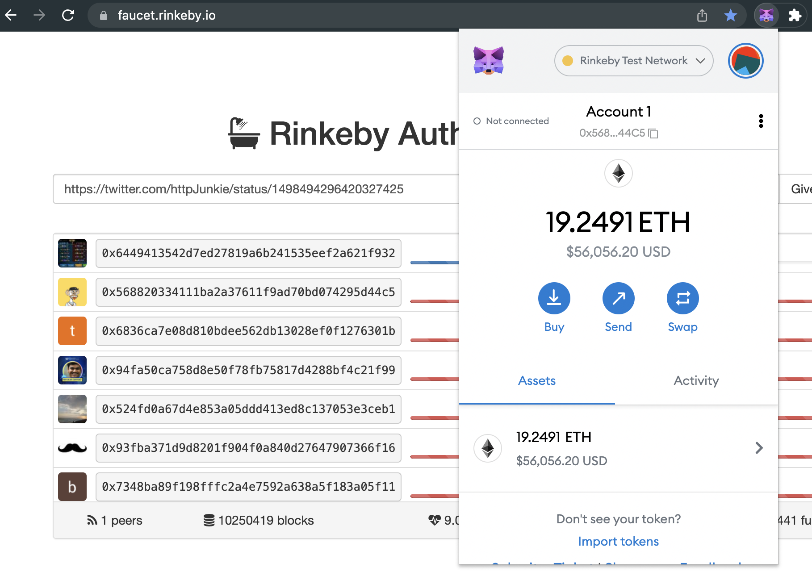

# Getting Started with This App

## Tool Prerequisites

You must have these tools installed
- NVM or NodeJS
- [Truffle](https://trufflesuite.com/docs/truffle/)
    > npm i truffle -g
- [Ganache](https://trufflesuite.com/ganache/index.html)
 - Personal Ethereum Blockchain
- [solidity](https://marketplace.visualstudio.com/items?itemName=JuanBlanco.solidity)
- [vscode-styled-components](https://marketplace.visualstudio.com/items?itemName=styled-components.vscode-styled-components)

## Optional Prerquisites

Add these VS Code extensions for productivity, code highlighting and debugging: 

- [solidity-extended](https://marketplace.visualstudio.com/items?itemName=beaugunderson.solidity-extended)
- [solidity-debugger](https://marketplace.visualstudio.com/items?itemName=hosho.solidity-debugger)

## Start Branch

We used Create React App to setup a working React project with some styles and pre-existing components, the rest we will build from scratch!

Some of the command we have already run are:

```bash
npx create-react-app stablecoin-nft-ticket-workshop`
```

```bash
npm i polished styled-components
```

```bash
npm i @openzeppelin/contracts
```

Run `npm i && npm start` and ensure that you get a standard React Projects with no errors in the terminal or in the browser console.

## Start Here

1. We will start by initializing Truffle in our repository:

```bash
truffle init
```

This will add a config, a migrations contract, an actual migrations javascript file and a directory for tests:

```
├── truffle-config.js  
├── contracts  
│   └── Migrations.sol  
├── migrations  
│   └── 1_initial_migration.js  
├── test  
│   └── .gitkeep  
```

2. Next we will open up Ganache and create a New Workspace with the same name as our repo: `nft-tickets-workshop` and connect your project by selecting Add Project and navigating to the `truffle-config.js` file we just created in the root of our project. Finally click Save Workspace and we get get access to a local blockchain specific for our project.


3. In our `truffle-config.js` file we want to uncomment the following lines:

- lines 44 through 48 (change the port to: `7545` to match Ganache RPC server port)
- line 84 (ensure we have a fairly up to date version `0.8.11`)

4. We will use Truffle to create our Contract:

```bash
truffle create contract Foxcon2022
```

This will create inside of our `contracts` directory a file named: `Foxcon2022.sol` with some basic contract code.

5. We will test out one more Truffle command real quick and see that the contract we just added will compile (as it should)

```bash
truffle compile
```

Although you may see a warning in the terminal our contract did compile, we can resolve the warnings as we build out our contract.

6. We need to create a migrations file for this contract, so let's create a file inside of the `migrations` directory named: `2_setup_Foxcon2022.js` and add the following code:

```js
const Foxcon2022 = artifacts.require("Foxcon2022");

module.exports = function (deployer) {
  deployer.deploy(Foxcon2022);
};
```

7. Now we can run our Truffle Migrate command:

```bash
truffle migrate
```

And we will see some output in the terminal and if we look in our Ganache app, we will see two contracts:


## Import ERC-721 Open Zeppelin Contract

OpenZeppelin is a well-tested set of libraries written in Solidity that you can import to your smart contracts while code is potentially being generated, maintained and deployed by truffle.

We have used the OpenZeppelin ERC-721 Wizard to generate the following code:

```ts
// SPDX-License-Identifier: MIT
pragma solidity ^0.8.4;

import "@openzeppelin/contracts/token/ERC721/ERC721.sol";
import "@openzeppelin/contracts/token/ERC721/extensions/ERC721URIStorage.sol";

contract Foxcon2022 is ERC721, ERC721URIStorage {
    constructor() ERC721("Foxcon2022", "FXC22") {}

    function _baseURI() internal pure override returns (string memory) {
        return "https://ipfs.io/ipfs/";
    }

    // The following functions are overrides required by Solidity.

    function _burn(uint256 tokenId) internal override(ERC721, ERC721URIStorage) {
        super._burn(tokenId);
    }

    function tokenURI(uint256 tokenId)
        public
        view
        override(ERC721, ERC721URIStorage)
        returns (string memory)
    {
        return super.tokenURI(tokenId);
    }
}
```

Let's compile what we have at this point:

```bash
truffle compile
```

Since we are importing a few OpenZeppelin files that in turn have their own dependencies, we will get much more than our one RPC contract `Foxcon2022.json`, built out into our `build/contracts` directory. As you can also see, these directories are ignored by git. 


As with anything that is generated by the compiler in our project, we don't really want this stuff pushed up to our GitHub repo.

We also see that OpenZeppelin has left us in a good place, everything is compiling just as it should, no warnings... Bet.

What we need to do next is to configure the details about out NFT tickets. We need to write the missing code that will give us individual NFT Tokens. Each ticket will be it's own token address. We will only create a select few, but our project could have many more if we wanted.

We want to set these tickets up so that when they are initially created, that we own them and can sell them.

## Creating Individual NFT Tokens

Let's replace the current `constructor()` with this new version of it, plus an extra solidity function to create eac of our NFT Tickets:

```ts
    uint256 _myTotalSupply = 0;
    constructor() ERC721("Foxcon2022", "FXC22") {
      // (to: who owns it?, tokenId: what token is owned?)
      _createTicket(msg.sender, 1, "QmcriZCeovxW61mYY6hNfYX1bmLh9gFUD294jhqUKkAUrk");
      _createTicket(msg.sender, 2, "QmR84E5VLg8CuYyky6ufomShta3yaJTmbhfzArG7vAdvS6");
      _createTicket(msg.sender, 3, "QmWUcWph126BHY6yV9hM8fFtdeitVbzqAihe2yZzMbeSvK");
    }

    function _createTicket(address to, uint id, string memory url) private returns(bool) {
      _safeMint(to, id);
      _setTokenURI(id, url);
      _myTotalSupply++;
      return true;
    }

    function totalSupply() view public returns(uint256) {
      return _myTotalSupply;
    }
```

At this point we are going to delete our build folder and we want to migrate this contract and test it locally with Ganache & Truffle.

```bash
truffle migrate
```

If we check Ganache after the migration is done, we will see all of our contracts, they are not deployed, but they are there:


As well, all of our build artifacts are back. We only deleted them to demonstrate that they get regenerated during compile, or migrations.

If we take the code inside of `Foxcon2022.sol` and paste it into the online Remix Solidity Editor and compile it, we could use the IDE's UI to play around with calling and accessing various functions that are provided to us through the OpenZeppelin inherited contracts. We could mint, setBalance and all sort's of cool things we can't easily do from our VS Code IDE without creating our own UI. Another interesting tool we could use is OneClickDapp, but we will get to more on those tools later.

## Setting up IPFS

We need a place to store our NFT images and accompanying metadata. For this we will use IPFS. WE don't want to use some unreliable storage, we want these assets to be accessible forever. We need an immutable storage facility that will hold our `json` metadata that points to our NFT Ticket image as well that stores information about our Ticket and we don't ever want it to change.

For this we will use IPFS.

Locally, we will install [IPFS Desktop](https://ipfs.io/#install), and go to the Files section in the app and drop in our `metadata-*.json` files from the `nft-ticket-data` directory.


When we Control click on these json files inside of our IPFS app, we can get a CID address, here is one of mine: `QmZrZQ2ykEfKnZcoeaXGCiZ36eMKopCa7d9oUwX4Nw1z6P`.

Now if we tag that onto the end of an IPFS URL, we can view that file on the internet in our browser:

[ipfs.io/ipfs/QmZrZQ2ykEfKnZcoeaXGCiZ36eMKopCa7d9oUwX4Nw1z6P](https://ipfs.io/ipfs/QmZrZQ2ykEfKnZcoeaXGCiZ36eMKopCa7d9oUwX4Nw1z6P)

Now we cna use that address when generating our NFTs. As you might have guessed, these three CIDs are going to be pasted into the corresponding NFT TIckets:

```ts
    constructor() ERC721("Foxcon2022", "FXC22") {
      // _private method
      // (to: who owns it?, tokenId: what token is owned?)
      _createTicket(msg.sender, 1, "QmZrZQ2ykEfKnZcoeaXGCiZ36eMKopCa7d9oUwX4Nw1z6P");
      _createTicket(msg.sender, 2, "QmcX4jHMfXTc3UcEy7R721SmEdz2hGMte9dv4APv6GSKrF");
      _createTicket(msg.sender, 3, "Qmcywck6BmUNhHzn559XzjHWJBsUChKqyRP8XqBMHk9FTs");
      // ^ generates 3 token NFTs that we can sell as tickets
    }

    function _createTicket(address to, uint id, string memory url) private returns(bool) {
      _safeMint(to, id);
      _setTokenURI(id, url);
      return true;
    }
```

As well we have updated the `_createTicket()` method to assign both `id` and `url` when we create each NFT Ticket.

## Pinning IPFS data with Infura

I have created an Infura account, it does require adding a credit card, but I am planning on using a Free account just for testing my project. Once I have setup an IPFS project inside Infura I will have access to a `projectId` and `projectSecret`. We will use these two values to pin our IPFS files using a terminal and [the IPFS API curl command](https://docs.infura.io/infura/networks/ipfs/getting-started/make-requests#use-curl):

We will run the following command for each `image-*.png` file we have, do this from the `nft-ticket-data` directory:

```bash
curl -X POST -F file=@image-0.png \
-u "PROJECT_ID:PROJECT_SECRET" \
"https://ipfs.infura.io:5001/api/v0/add"

curl -X POST -F file=@banner-0.png \
-u "PROJECT_ID:PROJECT_SECRET" \
"https://ipfs.infura.io:5001/api/v0/add"

curl -X POST -F file=@featured-0.png \
-u "PROJECT_ID:PROJECT_SECRET" \
"https://ipfs.infura.io:5001/api/v0/add"

curl -X POST -F file=@image-1.png \
-u "PROJECT_ID:PROJECT_SECRET" \
"https://ipfs.infura.io:5001/api/v0/add"

curl -X POST -F file=@image-2.png \
-u "PROJECT_ID:PROJECT_SECRET" \
"https://ipfs.infura.io:5001/api/v0/add"

curl -X POST -F file=@image-3.png \
-u "PROJECT_ID:PROJECT_SECRET" \
"https://ipfs.infura.io:5001/api/v0/add"
```

> You can watch a video with Infura's own [Michael Godsey](https://blog.infura.io/author/michael-godsey/) in this YouTube video: [Infura Demos New Enhanced IPFS API Beta](https://www.youtube.com/watch?v=mLEkACKx_sc)

At this point we will have each file hosted on IPFS and pinned by Infura for faster retrieval:


Now we can add that IPFS url for each image in our `metadata-*.json` files, here is the example for the first NFT Ticket metadata file, but do this for each one before we add them to Infura's IPFS and pinn them:

```json
{ 
  "name": "Foxcon VIP 1001",
  "description": "Very Important Person ticket, attendee number 1001",
  "image": "https://ipfs.io/ipfs/QmSyYogHVHSdxqXuvnitJRg3dbspeaJDznqZADLsfE6oxN",
  "properties": {
    "ticketType": "VIP", 
    "ticketNumber": 1001, 
    "event": "Foxcon 2022",
    "guests": 3
  }
}
```

We will run the following command for each `metadata-*.json` file we have, do this from the `nft-ticket-data` directory:

```bash
curl -X POST -F file=@metadata-0.json \
-u "PROJECT_ID:PROJECT_SECRET" \
"https://ipfs.infura.io:5001/api/v0/add"

curl -X POST -F file=@metadata-1.json \
-u "PROJECT_ID:PROJECT_SECRET" \
"https://ipfs.infura.io:5001/api/v0/add"

curl -X POST -F file=@metadata-2.json \
-u "PROJECT_ID:PROJECT_SECRET" \
"https://ipfs.infura.io:5001/api/v0/add"

curl -X POST -F file=@metadata-3.json \
-u "PROJECT_ID:PROJECT_SECRET" \
"https://ipfs.infura.io:5001/api/v0/add"
```

At this point we will have all six files hosted on IPFS and pinned by Infura for faster retrieval:


## Deploying our NFT Ticket Project to Rinkeby

The first place we should make some changes to deploy this to a testnet is in our `truffle-config.js`, we need to uncomment the following lines:

- 21 through 24 ()

```js
const HDWalletProvider = require('@truffle/hdwallet-provider');

const fs = require('fs');
const mnemonic = fs.readFileSync(".secret").toString().trim();
```

We will need to create a new file named: `.secret` and inside of it, add the following code:

```js
my twelve word secret
```

Update your `.gitignore` with `.secret` in order to not track this file.

We will also need a wallet, I have created a MetaMask account specifically for this course. I will need to go inside of it and retrieve my 12 word passphrase.


- 60 through 69 (ropsten object)

We will change "ropsten" to "rinkeby" and the rest will look like:

```js
rinkeby: {
  provider: () => new HDWalletProvider(
  mnemonic, `https://rinkeby.infura.io/v3/INFURA_PROJECT_ENDPOINT`
  ),
  from: 'PUBLIC_WALLET_ADDRESS', // Public wallet address
  network_id: 4,       // rinkeby's id
  gas: 5500000,        // rinkeby has a lower block limit than mainnet
  timeoutBlocks: 200,  // # of blocks before a deployment times out  (minimum/default: 50)
  skipDryRun: true     // Skip dry run before migrations? (default: false for public nets )
},
```

With this all in place, we can deploy our contracts to the Renkeby testnet. 

You will need some test ETH from the [Rinkeby Faucet](https://faucet.rinkeby.io/)



With that in place, let's test it out!

```bash
truffle migrate --network rinkeby
```

```bash
Compiling your contracts...
===========================
> Compiling ./contracts/Foxcon2022.sol
> Artifacts written to /Users/eric/src/github/metamask/nft-tickets-workshop/build/contracts
> Compiled successfully using:
   - solc: 0.8.4+commit.c7e474f2.Emscripten.clang


Starting migrations...
======================
> Network name:    'rinkeby'
> Network id:      4
> Block gas limit: 29999943 (0x1c9c347)


1_initial_migration.js
======================

   Deploying 'Migrations'
   ----------------------
   > transaction hash:    0xcbb72c2d00187727d7ec8510ef38c7e2a54cab97d0d8d7221f010cb4cf9f3877
   > Blocks: 1            Seconds: 4
   > contract address:    0x5e5e386F82e6A1a3cd140395CB8E9D3974024dE3
   > block number:        10250442
   > block timestamp:     1646104223
   > account:             0x568820334111ba2a37611F9Ad70BD074295D44C5
   > balance:             19.248456184990266691
   > gas used:            248204 (0x3c98c)
   > gas price:           2.50000001 gwei
   > value sent:          0 ETH
   > total cost:          0.00062051000248204 ETH

   Pausing for 2 confirmations...

   -------------------------------
   > confirmation number: 1 (block: 10250443)
   > confirmation number: 2 (block: 10250444)
   > Saving migration to chain.
   > Saving artifacts
   -------------------------------------
   > Total cost:     0.00062051000248204 ETH


2_setup_foxcon2022.js
=====================

   Deploying 'Foxcon2022'
   ----------------------
   > transaction hash:    0x9b17201cfc24bf9989ffc45e94c38e933a689eafaa12e79685952a109ceb1f1f
   > Blocks: 1            Seconds: 12
   > contract address:    0x0ea56cFFcAe68aeaDc1cB6688e1D51947e8E8712
   > block number:        10250446
   > block timestamp:     1646104283
   > account:             0x568820334111ba2a37611F9Ad70BD074295D44C5
   > balance:             19.24202006246709665
   > gas used:            2528536 (0x269518)
   > gas price:           2.500000009 gwei
   > value sent:          0 ETH
   > total cost:          0.006321340022756824 ETH

   Pausing for 2 confirmations...

   -------------------------------
   > confirmation number: 1 (block: 10250447)
   > confirmation number: 2 (block: 10250448)
   > Saving migration to chain.
   > Saving artifacts
   -------------------------------------
   > Total cost:     0.006321340022756824 ETH

Summary
=======
> Total deployments:   2
> Final cost:          0.006941850025238864 ETH
```

YOur output should look similar to above if everything goes swell! As you can see this actually would have cost ETH, on the testnet our final ETH payment was: `0.006941850025238864 ETH`. If we would have deployed tens or hundreds of NFTs, you can see how the overall cost would have been much higher.

We cna grab the `contract address` from here:

```bash
...
2_setup_foxcon2022.js
=====================

   Deploying 'Foxcon2022'
   ----------------------
   > transaction hash:    0x9b17201cfc24bf9989ffc45e94c38e933a689eafaa12e79685952a109ceb1f1f
   > Blocks: 1            Seconds: 12
   > contract address:    0x0ea56cFFcAe68aeaDc1cB6688e1D51947e8E8712
...
```

And we can go to the [OpenSea's Rinkeby Testnet](https://testnets.opensea.io) and navigate to:

- Profile > My Collections
- And click on the kebob menu


THen we will select "Rinkeby" from the dropdown and past in our `contract address` value from above.

We will then see our NFT Tickets project, and you might think that something has gone wrong as we do not see our images, but they will show up in a few minutes. So long as we got all of the linking right!


At this point you can decide to delete your `.secret` file. For instance, if we want to deploy to mainnet using a different owner, we could do that. Just remember, never to share you secret passphrase or private keys ever.

If you are not seeing your NFT artwork show up, you could refresh and/or wait a few minutes, but beyond that, you could debug your NFT to see if there are any issues using the following link:

[https://testnets-api.opensea.io/asset/<your_contract_address>/<your_token_id>/validate/ ](https://testnets-api.opensea.io/asset/<contract_address>/<token_id>/validate/)

Just add your `contract_address` from the deploy output and update the `token_id`. Here is an example of a valid and invalid result:

- [VALID ASSET](https://testnets-api.opensea.io/asset/0xBA1c7B327EfAD20F439a06694adE3Cdc89690A29/3/validate/)
- [INVALID ASSET](https://testnets-api.opensea.io/asset/0x0ea56cFFcAe68aeaDc1cB6688e1D51947e8E8712/3/validate/)

This could help you track down if maybe you supplied the wrong IPFS file to represent your metadata or maybe if your NFT image URL was linked incorrectly. There are several places you could have gone wrong and that is the whole idea of testing your process out on a testnet first before deploying to a mainnet.

If we look at the description, properties, levels and details of our NFT on OpenSea, we can see our `metadata-1.json` at work:


## Connect to our Contract in React

We will need to create a `.env` file to store some of our project data, a little less sensitive than our wallet passphrase, and for this reason we will put all other project config data in environment variables:

```bash
REACT_APP_INFURA_ENDPOINT=https://rinkeby.infura.io/v3/4b9789bfd31b46fd9df6934461cfbe52
REACT_APP_NFT_CONTRACT_ADDRESS=0xBA1c7B327EfAD20F439a06694adE3Cdc89690A29
```

In Create React App, anything placed in these files with the `REACT_APP_` prefix will be available will be defined for us on `process.env`. 

First we need to install Web3JS to to connect to our contract via our Infura Project:

```bash
npm i web3 npc
```

Let's make a `src/lib` directory in our project and import `Foxcon2022` contract and export out the values we need:

**src/lib/web3.js**
```js
import Web3 from 'web3'
import Foxcon2022 from './Foxcon2022.json'

let web3 = new Web3(process.env.REACT_APP_INFURA_ENDPOINT)

const contractAddress = process.env.REACT_APP_NFT_CONTRACT_ADDRESS
const contract = new web3.eth.Contract(Foxcon2022.abi, contractAddress)

export { web3, contract, contractAddress }
```

We will also create a script to copy our "Application Binary Interface (ABI)" created from our contract build that we get when we run `truffle compile` or `truffle migrate`.

**copyJson.js**
```js
let path = require('path');
let ncp = require('ncp').ncp;

ncp.limit = 16;

let srcPath = 'build/contracts/Foxcon2022.json'
let destPath = 'src/lib/Foxcon2022.json'

console.log('Copying Contract JSON files...');
ncp(srcPath, destPath, function (err) {
  if (err) {
    console.log('copy error...');
    return console.error(err);
  }
  console.log('copy complete...');
});
```

Finally in this step, we will also add our script by itself in the `package.json` as well as a prerequisite to our `npm start` script:

**package.json**
```
  "scripts": {
    "start": "node copyJson.js && react-scripts start",
    "build": "react-scripts builds",
    "test": "react-scripts test",
    "eject": "react-scripts eject",
    "copy": "node copyJson.js"
  },
```


## Resources

- [ETH Denver - Deploy Your Own NFT with Infura, ConsenSys NFT and Replit - Kristofer Shinn](https://www.youtube.com/watch?v=kim7T4GDFOM)
- [ETH Denver 2022 Infura NFT Slides](https://docs.google.com/presentation/d/e/2PACX-1vRmrW8raDcXbRvOl3aRn1R95wpLRUyILqI86EFpEZj8BKz_bCajBYk79uUGyfaKzqFf_YOZ4XeBjuPS/pub?start=false&loop=false&delayms=30000&slide=id.ga7c7e0fb3e_7_0)
- [ETH Denver - Infura Demo](https://www.youtube.com/watch?v=OPtt2SiQ4qk)